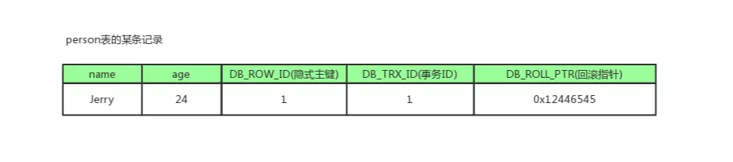
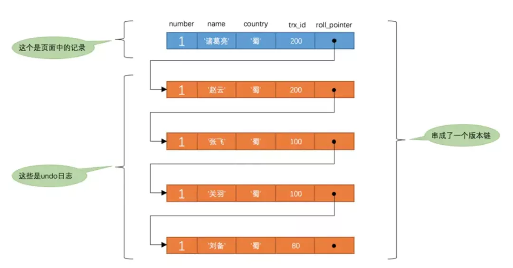

### MVCC多版本并发控制

全称Multi-Version Concurrency Control，即`多版本并发控制`，主要是为了提高数据库的`并发性能`

同一行数据平时发生读写请求时，会`上锁阻塞`住。但mvcc用更好的方式去处理读—写请求，做到在发生读—写请求冲突时`不用加锁`。

这个读是指的`快照读`，而不是`当前读`，当前读是一种加锁操作，是`悲观锁`。

#### 什么是快照读？什么是当前读？

##### 当前读

它读取的数据库记录，都是`当前最新`的`版本`，会对当前读取的数据进行`加锁`，防止其他事务修改数据。是`悲观锁`的一种操作。

如下操作都是当前读：

- select lock in share mode (共享锁)
- select for update (排他锁)
- update (排他锁)
- insert (排他锁)
- delete (排他锁)
- 串行化事务隔离级别

##### 快照读

快照读的实现是基于`多版本`并发控制，即MVCC，既然是多版本，那么快照读读到的数据不一定是当前最新的数据，有可能是之前`历史版本`的数据。

如下操作是快照读：

- 不加锁的select操作（注：事务级别不是串行化）

### **快照读与mvcc的关系**

`MVCC`是“维持一个数据的多个版本，使读写操作没有冲突”的一个`抽象概念`。

##### 数据库并发场景

- `读-读`：不存在任何问题，也不需要并发控制
- `读-写`：有线程安全问题，可能会造成事务隔离性问题，可能遇到脏读，幻读，不可重复读
- `写-写`：有线程安全问题，可能会存在更新丢失问题，比如第一类更新丢失，第二类更新丢失

## **MVCC解决并发哪些问题？**

mvcc用来解决读—写冲突的无锁并发控制，就是为事务分配`单向增长`的`时间戳`。为每个数据修改保存一个`版本`，版本与事务时间戳`相关联`。

读操作`只读取`该事务`开始前`的`数据库快照`。

**解决问题如下：**

- `并发读-写时`：可以做到读操作不阻塞写操作，同时写操作也不会阻塞读操作。
- 解决`脏读`、`幻读`、`不可重复读`等事务隔离问题，但不能解决上面的`写-写 更新丢失`问题。

**因此有了下面提高并发性能的`组合拳`：**

- `MVCC + 悲观锁`：MVCC解决读写冲突，悲观锁解决写写冲突
- `MVCC + 乐观锁`：MVCC解决读写冲突，乐观锁解决写写冲突

### **MVCC的实现原理**

它的实现原理主要是`版本链`，`undolog` ，`Read View`来实现的

##### 版本链

我们数据库中的每行数据，除了我们肉眼看见的数据，还有几个`隐藏字段`，分别是`db_trx_id`、`db_roll_pointer`、`db_row_id`。

- db_trx_id

  6byte，最近修改(修改/插入)`事务ID`：记录`创建`这条记录/`最后一次修改`该记录的`事务ID`。

- db_roll_pointer（版本链关键）

  7byte，`回滚指针`，指向`这条记录`的`上一个版本`（存储于rollback segment里）

- db_row_id

  6byte，隐含的`自增ID`（隐藏主键），如果数据表`没有主键`，InnoDB会自动以db_row_id产生一个`聚簇索引`。

- 实际还有一个`删除flag`隐藏字段, 记录被`更新`或`删除`并不代表真的删除，而是`删除flag`变了

如上图，`db_row_id`是数据库默认为该行记录生成的`唯一隐式主键`，`db_trx_id`是当前操作该记录的`事务ID`，而`db_roll_pointer`是一个`回滚指针`，用于配合`undo日志`，指向上一个`旧版本`。

每次对数据库记录进行改动，都会记录一条`undo日志`，每条undo日志也都有一个`roll_pointer`属性（INSERT操作对应的undo日志没有该属性，因为该记录并没有更早的版本），可以将这些`undo日志都连起来`，`串成一个链表`，所以现在的情况就像下图一样：

对该记录每次更新后，都会将旧值放到一条undo日志中，就算是该记录的一个旧版本，随着更新次数的增多，所有的版本都会被`roll_pointer`属性连接成一个`链表`，我们把这个链表称之为`版本链`，版本链的头节点就是当前记录最新的值。另外，每个版本中还包含生成该版本时对应的事务id，这个信息很重要，在根据ReadView判断版本可见性的时候会用到。

#### Undo log

Undo log 主要用于`记录`数据被`修改之前`的日志，在表信息修改之前先会把数据拷贝到`undo log`里。

当`事务`进行`回滚时`可以通过undo log 里的日志进行`数据还原`。

**Undo log 的用途**

- 保证`事务`进行`rollback`时的`原子性和一致性`，当事务进行`回滚`的时候可以用undo log的数据进行`恢复`。
- 用于MVCC`快照读`的数据，在MVCC多版本控制中，通过读取`undo log`的`历史版本数据`可以实现`不同事务版本号`都拥有自己`独立的快照数据版本`。

**undo log主要分为两种：**

- insert undo log

  代表事务在insert新记录时产生的undo log , 只在事务回滚时需要，并且在事务提交后可以被立即丢弃

- update undo log（主要）

  事务在进行update或delete时产生的undo log ; 不仅在事务回滚时需要，在快照读时也需要；

  所以不能随便删除，只有在快速读或事务回滚不涉及该日志时，对应的日志才会被purge线程统一清除

#### **Read View(读视图)**

事务进行`快照读`操作的时候生产的`读视图`(Read View)，在该事务执行的快照读的那一刻，会生成数据库系统当前的一个`快照`。

记录并维护系统当前`活跃事务的ID`(没有commit，当每个事务开启时，都会被分配一个ID, 这个ID是递增的，所以越新的事务，ID值越大)，是系统中当前不应该被`本事务`看到的`其他事务id列表`。

Read View主要是用来做`可见性`判断的, 即当我们`某个事务`执行`快照读`的时候，对该记录创建一个Read View读视图，把它比作条件用来判断`当前事务`能够看到`哪个版本`的数据，既可能是当前`最新`的数据，也有可能是该行记录的undo log里面的`某个版本`的数据。

**Read View几个属性**

- `trx_ids`: 当前系统活跃(`未提交`)事务版本号集合。
- `low_limit_id`: 创建当前read view 时“当前系统`最大事务版本号`+1”。
- `up_limit_id`: 创建当前read view 时“系统正处于活跃事务`最小版本号`”
- `creator_trx_id`: 创建当前read view的事务版本号；

#### **Read View可见性判断条件**(判断当前应该查询哪个快照)

- `db_trx_id` < `up_limit_id` || `db_trx_id` == `creator_trx_id`（显示）

  如果数据事务ID小于read view中的`最小活跃事务ID`，则可以肯定该数据是在`当前事务启之前`就已经`存在`了的,所以可以`显示`。

  或者数据的`事务ID`等于`creator_trx_id` ，那么说明这个数据就是当前事务`自己生成的`，自己生成的数据自己当然能看见，所以这种情况下此数据也是可以`显示`的。

- `db_trx_id` >= `low_limit_id`（不显示）

  如果数据事务ID大于read view 中的当前系统的`最大事务ID`，则说明该数据是在当前read view 创建`之后才产生`的，所以数据`不显示`。如果小于则进入下一个判断

- `db_trx_id`是否在`活跃事务`（trx_ids）中

- - `不存在`：则说明read view产生的时候事务`已经commit`了，这种情况数据则可以`显示`。
  - `已存在`：则代表我Read View生成时刻，你这个事务还在活跃，还没有Commit，你修改的数据，我当前事务也是看不见的。

### **MVCC和事务隔离级别**

上面所讲的`Read View`用于支持`RC`（Read Committed，读提交）和`RR`（Repeatable Read，可重复读）`隔离级别`的`实现`。

#### **RR、RC生成时机** 

- `RC`隔离级别下，是每个`快照读`都会`生成并获取最新`的`Read View`；
- 而在`RR`隔离级别下，则是`同一个事务中`的`第一个快照读`才会创建`Read View`, `之后的`快照读获取的都是`同一个Read View`，之后的查询就`不会重复生成`了，所以一个事务的查询结果每次`都是一样的`。

#### **解决幻读问题**

- `快照读`：通过MVCC来进行控制的，不用加锁。按照MVCC中规定的“语法”进行增删改查等操作，以避免幻读。
- `当前读`：通过next-key锁（行锁+gap间隙锁）来解决问题的。

### **RC、RR级别下的InnoDB快照读区别**

- 在RR级别下的某个事务的对某条记录的第一次快照读会创建一个快照及Read View， 将当前系统活跃的其他事务记录起来，此后在调用快照读的时候，还是使用的是同一个Read View，所以只要当前事务在其他事务提交更新之前使用过快照读，那么之后的快照读使用的都是同一个Read View，所以对之后的修改不可见；
- 即RR级别下，快照读生成Read View时，Read View会记录此时所有其他活动事务的快照，这些事务的修改对于当前事务都是不可见的。而早于Read View创建的事务所做的修改均是可见
- 而在RC级别下的，事务中，每次快照读都会新生成一个快照和Read View, 这就是我们在RC级别下的事务中可以看到别的事务提交的更新的原因