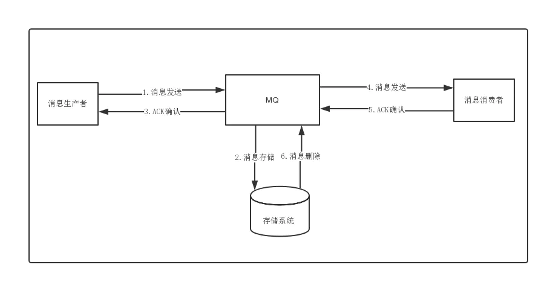
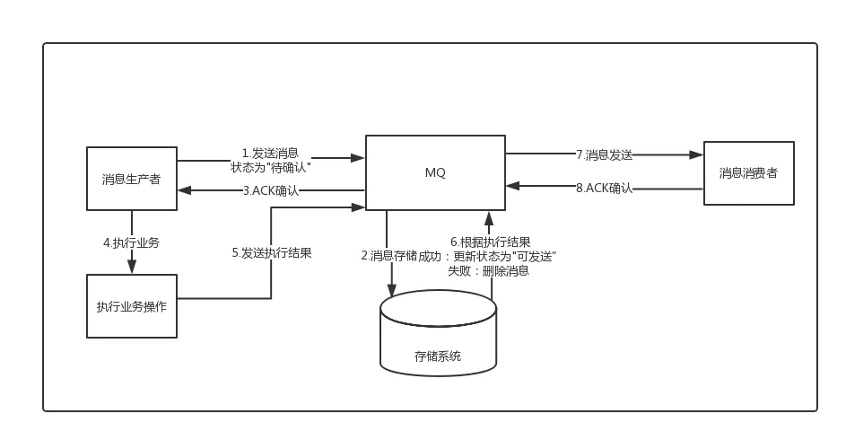

## 如何通过消息中间件实现分布式事务

虽然有基于两阶段提交的XA分布式事务，但是这类方案因为需要资源的全局锁定，导致性能极差；

因此后面就逐渐衍生出了消息最终一致性、TCC等柔性事务的分布式事务方案，现在主要分析一下基于消息的最终一致性方案。

### 普通消息的处理逻辑

1. 消息生成者发送消息
2. MQ收到消息，将消息进行持久化，在存储中新增一条记录
3. 返回ACK给消费者
4. MQ push 消息给对应的消费者，然后等待消费者返回ACK
5. 如果消息消费者在指定时间内成功返回ack，那么MQ认为消息消费成功，在存储中删除消息，即执行第6步；如果MQ在指定时间内没有收到ACK，则认为消息消费失败，会尝试重新push消息,重复执行4、5、6步骤
6. MQ删除消息

有可能产生的异常情况：
1. a事务处理成功，服务宕机，事务未提交，消息没有发送出去（**仍保持一致性**）
2. a事务处理成功，由于网络原因或者MQ宕机，消息没有发送出去，事务回滚（**仍保持一致性**）
3. a事务处理成功，消息发送成功，但是MQ由于其他原因，导致消息存储失败，事务回滚（**仍保持一致性**）
4. a事务处理成功，消息存储成功，但是MQ处理超时，b服务ACK确认失败，导致发送方本地事务回滚  （**数据不一致**）

由上可得，使用普通的方式无论如何都没办法做到消息两方的事务的一致性

### 事务性消息
由于传统的处理方式无法解决**消息生成者本地事务处理成功**与**消息发送成功**两者的一致性问题，因此事务消息就诞生了，它实现了**消息生成者本地事务与消息发送的原子性，保证了消息生成者本地事务处理成功与消息发送成功的最终一致性问题**。

1. 事务消息与普通消息的区别就在于消息生产环节，生产者首先预发送一条消息到MQ(这也被称为发送half消息)
2. MQ接受到消息后，先进行持久化，则存储中会新增一条状态为`待发送`的消息
3. 然后返回ACK给消息生产者，此时MQ不会触发消息推送事件
4. 生产者预发送消息成功后，执行本地事务
5. 执行本地事务，执行完成后，发送执行结果给MQ
6. MQ会根据结果删除或者更新消息状态为`可发送`
7. 如果消息状态更新为`可发送`，则MQ会push消息给消费者，后面消息的消费和普通消息是一样的

#### 注意点：
由于MQ通常都会保证消息能够投递成功，因此，如果业务没有及时返回ACK结果，那么就有可能造成MQ的重复消息投递问题。**因此，对于消息最终一致性的方案，消息的消费者必须要对消息的消费支持幂等，不能造成同一条消息的重复消费的情况。**

有可能产生的异常情况：
1. 消息未存储，业务操作未执行 （**仍保持一致性**）
2. 存储`待发送`消息成功，但是ACK失败，导致业务未执行(可能是MQ处理超时、网络抖动等原因) (**不保持一致**) 

    处理异常：MQ确认业务操作结果，处理消息(删除消息)
3. 存储`待发送`消息成功，ACK成功，业务执行(可能成功也可能失败)，但是MQ没有收到生产者业务处理的最终结果(**不保持一致**) 

    处理异常：MQ确认业务操作结果，处理消息(根据就业务处理结果，更新消息状态，如果业务执行成功，则投递消息，失败则删除消息)
4. 业务处理成功，并且发送结果给MQ，但是MQ更新消息失败，导致消息状态依旧为待发送

    处理异常：MQ确认业务操作结果，处理消息(根据就业务处理结果，更新消息状态，如果业务执行成功，则投递消息，失败则删除消息)

现在目前较为主流的MQ，比如ActiveMQ、RabbitMQ、Kafka、RocketMQ等，只有RocketMQ支持事务消息。

RocketMQ就是其内部实现会有一个定时任务，去轮训状态为待发送的消息，然后给producer发送check请求，而producer必须实现一个check监听器，监听器的内容通常就是去检查与之对应的本地事务是否成功(一般就是查询DB)，如果成功了，则MQ会将消息设置为可发送，否则就删除消息。

### 独立消息服务的最终一致性

1. 消息生产者调用消息服务系统的预发送消息接口
2. 消息服务系统存储消息，状态为`待发送`
3. 消息生产者执行业务操作
4. 发送业务处理结果给消息服务系统（如果出现问题，则还有定时任务去轮训长时间为`待发送`状态的数据，再次反调用生产者的消息确认接口），消息状态改为可发送
5. 定时轮训状态为`可发送`的消息发送消息给mq
6. mq确认收到消息后ack告知消息服务系统收到消息
7. mq存储消息
8. mq发送消息给消息消费者，保证幂等
9. 消费者进行业务处理
10. 返回ack（如果消息消费者失败，则扔回队列继续消费）

独立消息服务的最终一致性**最核心做法就是在执行业务操作前，调用预发送接口，并且预发送与业务数据的记录必须在同一个事务内完成，这是该方案的前提核心保障。**

预发送成功后，通过一个定时任务到DB中去轮训状态为待发送的消息，然后将消息投递给MQ。这个过程中可能存在消息投递失败的可能，此时就依靠重试机制来保证，直到成功收到MQ的ACK确认之后，再将消息状态更新或者消息清除；

而后面消息的消费失败的话，则依赖MQ本身的重试来完成，其最后做到两边系统数据的最终一致性。