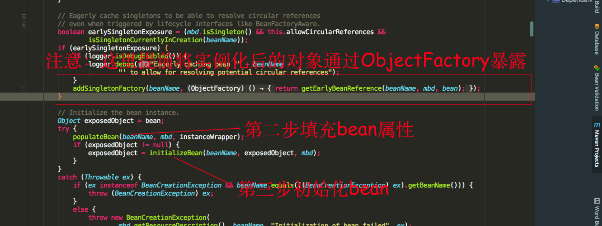
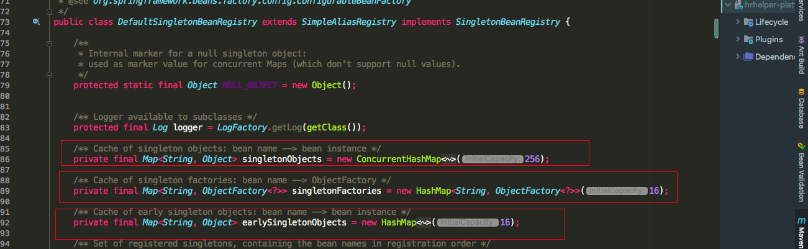
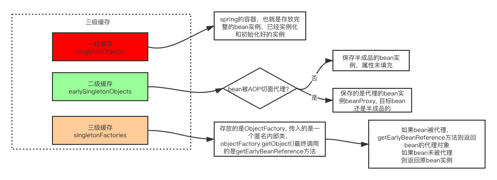
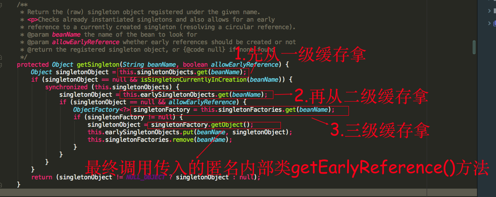

## spring如何解决循环依赖

spring在填充属性时，如果发现该属性还没有在spring生成，则会跑去生成属性对象实例

我们可以看到填充属性的时候，spring会提前将已经实例化的bean通过ObjectFactory半成品暴露出去，为什么称为半成品是因为这时候的bean对象实例化，但是未进行属性填充，是一个不完整的bean实例对象

spring利用singletonObjects, earlySingletonObjects, singletonFactories三级缓存去解决的，所说的缓存其实也就是三个Map

可以看到三级缓存各自保存的对象，这里重点关注二级缓存earlySingletonObjects和三级缓存singletonFactory，一级缓存可以进行忽略。前面我们讲过先实例化的bean会通过ObjectFactory半成品提前暴露在三级缓存中

singletonFactory是传入的一个匿名内部类，调用ObjectFactory.getObject()最终会调用getEarlyBeanReference方法。再来看看循环依赖中是怎么拿其它半成品的实例对象的。

  我们假设现在有这样的场景AService依赖BService，BService依赖AService

​    1. AService首先实例化，实例化通过ObjectFactory半成品暴露在三级缓存中

​    2. 填充属性BService，发现BService还未进行过加载，就会先去加载BService

​    3. 再加载BService的过程中，实例化，也通过ObjectFactory半成品暴露在三级缓存

​    4. 填充属性AService的时候，这时候能够从三级缓存中拿到半成品的ObjectFactory

拿到ObjectFactory对象后，调用ObjectFactory.getObject()方法最终会调用getEarlyBeanReference()方法，getEarlyBeanReference这个方法主要逻辑大概描述下如果bean被AOP切面代理则返回的是beanProxy对象，如果未被代理则返回的是原bean实例，这时我们会发现能够拿到bean实例(属性未填充)，然后从三级缓存移除，放到二级缓存earlySingletonObjects中，而此时B注入的是一个半成品的实例A对象，不过随着B初始化完成后，A会继续进行后续的初始化操作，最终B会注入的是一个完整的A实例，因为在内存中它们是同一个对象。下面是重点，我们发现这个二级缓存好像显得有点多余，好像可以去掉，只需要一级和三级缓存也可以做到解决循环依赖的问题？？？

### 为什么不是二级缓存？（解决aop代理对象）

首先如果存在aop那么容器终注入的应该是代理对象，**所以如果没有AOP的话确实可以两级缓存就可以解决循环依赖的问题，如果加上AOP，两级缓存是无法解决的，不可能每次执行singleFactory.getObject()方法都给我产生一个新的代理对象，所以还要借助另外一个缓存来保存产生的代理对象**

