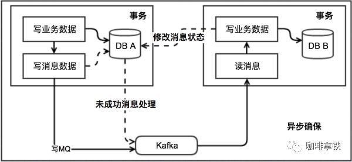

#### 一、两段式提交（2PC）

两阶段提交（Two-phase Commit，2PC），通过引入协调者（Coordinator）来协调参与者的行为，并最终决定这些参与者是否要真正执行事务。

**两类节点**：一个是中心化`协调者节点`（coordinator）和`N个参与者节点`（partcipant）。

`两个阶段`：第一阶段：**投票阶段** 和第二阶段：**提交/执行阶段**。

`举例` **订单服务A**，需要调用 **支付服务B** 去支付，支付成功则处理购物订单为待发货状态，否则就需要将购物订单处理为失败状态。

##### 1. 第一阶段：投票阶段

第一阶段主要分为3步

1）`事务询问`

**协调者** 向所有的 **参与者** 发送**事务预处理请求**，称之为**Prepare**，并开始等待各 **参与者** 的响应。

2）`执行本地事务`

各个 **参与者** 节点执行本地事务操作,但在执行完成后并**不会真正提交数据库本地事务**，而是先向 **协调者** 报告说：“我这边可以处理了/我这边不能处理”。.

3）`各参与者向协调者反馈事务询问的响应`

如果 **参与者** 成功执行了事务操作,那么就反馈给协调者 **Yes** 响应,表示事务可以执行,如果没有 **参与者** 成功执行事务,那么就反馈给协调者 **No** 响应,表示事务不可以执行。

第一阶段执行完后，会有两种可能。1、所有都返回Yes. 2、有一个或者多个返回No。

##### 2. 第二阶段：提交/执行阶段（成功流程）

`成功条件`：所有参与者都返回Yes。

第二阶段主要分为两步

 1)`所有的参与者反馈给协调者的信息都是Yes,那么就会执行事务提交`

 **协调者** 向 **所有参与者** 节点发出Commit请求.

 2)`事务提交`

 **参与者** 收到Commit请求之后,就会正式执行本地事务Commit操作,并在完成提交之后释放整个事务执行期间占用的事务资源。

##### 3. 第二阶段：提交/执行阶段（异常流程）

`异常条件`：任何一个 **参与者** 向 **协调者** 反馈了 **No** 响应,或者等待超时之后,协调者尚未收到所有参与者的反馈响应。

异常流程第二阶段也分为两步

1)`发送回滚请求`

 **协调者** 向所有参与者节点发出 **RoollBack** 请求.

 2)`事务回滚`

 **参与者** 接收到RoollBack请求后,会回滚本地事务。

##### 2PC的缺点

1）`性能问题`

无论是在第一阶段的过程中,还是在第二阶段,**所有的参与者资源和协调者资源都是被锁住的**,只有当所有节点准备完毕，事务 **协调者** 才会通知进行全局提交，

**参与者** 进行本地事务提交后才会释放资源。这样的**过程会比较漫长，对性能影响比较大**。

2）`单节点故障`

由于**协调者**的重要性，一旦 **协调者** 发生故障。**参与者** 会一直阻塞下去。尤其在第二阶段，**协调者** 发生故障，那么所有的 **参与者** 还都处于

锁定事务资源的状态中，而无法继续完成事务操作。（虽然协调者挂掉，可以重新选举一个协调者，但是无法解决因为协调者宕机导致的参与者处于阻塞状态的问题）

**2PC出现单点问题的三种情况**

(1)`协调者正常,参与者宕机`

 由于 **协调者** 无法收集到所有 **参与者** 的反馈，会陷入阻塞情况。

 **解决方案**:引入超时机制,如果协调者在超过指定的时间还没有收到参与者的反馈,事务就失败,向所有节点发送终止事务请求。

(2)`协调者宕机,参与者正常`

 无论处于哪个阶段，由于**协调者宕机**，无法发送提交请求，所有处于执行了操作但是未提交状态的参与者都会陷入阻塞情况.

 **解决方案**:引入协调者备份,同时协调者需记录操作日志.当检测到协调者宕机一段时间后，协调者备份取代协调者，并读取操作日志，向所有参与者询问状态。

(3)`协调者和参与者都宕机`

1. **发生在第一阶段**： 因为第一阶段，所有参与者都没有真正执行commit，所以只需重新在剩余的参与者中重新选出一个协调者，新的协调者在重新执行第一阶段和第二阶段就可以了。

2)**发生在第二阶段 并且 挂了的参与者在挂掉之前没有收到协调者的指令**。也就是上面的第4步挂了，这是可能协调者还没有发送第4步就挂了。这种情形下，新的协调者重新执行第一阶段和第二阶段操作。

3)**发生在第二阶段 并且 有部分参与者已经执行完commit操作**。就好比这里订单服务A和支付服务B都收到**协调者** 发送的commit信息，开始真正执行本地事务commit,但突发情况，Acommit成功，B确挂了。这个时候目前来讲数据是不一致的。虽然这个时候可以再通过手段让他和协调者通信，再想办法把数据搞成一致的，但是，这段时间内他的数据状态已经是不一致的了！ 2PC 无法解决这个问题。

#### 二、TCC补偿事务

TCC 其实就是采用的补偿机制，其核心思想是：针对每个操作，都要注册一个与其对应的确认和补偿（撤销）操作。它分为三个阶段：

- Try 阶段主要是对业务系统做检测及资源预留
- Confirm 阶段主要是对业务系统做确认提交，Try阶段执行成功并开始执行 Confirm阶段时，默认 Confirm阶段是不会出错的。即：只要Try成功，Confirm一定成功。
- Cancel 阶段主要是在业务执行错误，需要回滚的状态下执行的业务取消，预留资源释放。

举个例子，假入 Bob 要向 Smith 转账，思路大概是： 我们有一个本地方法，里面依次调用

1. 首先在 Try 阶段，要先调用远程接口把 Smith 和 Bob 的钱给冻结起来。
2. 在 Confirm 阶段，执行远程调用的转账的操作，转账成功进行解冻。
3. 如果第2步执行成功，那么转账成功，如果第二步执行失败，则调用远程冻结接口对应的解冻方法 (Cancel)。

优点： 跟2PC比起来，实现以及流程相对简单了一些，但数据的一致性比2PC也要差一些

缺点： 缺点还是比较明显的，在2,3步中都有可能失败。TCC属于应用层的一种补偿方式，所以需要程序员在实现的时候多写很多补偿的代码，在一些场景中，一些业务流程可能用TCC不太好定义及处理。

#### 三、本地消息表

基本思路就是：

消息生产方，需要额外建一个消息表，并记录消息发送状态。消息表和业务数据要在一个事务里提交，也就是说他们要在一个数据库里面。然后消息会经过MQ发送到消息的消费方。如果消息发送失败，会进行重试发送。

消息消费方，需要处理这个消息，并完成自己的业务逻辑。此时如果本地事务处理成功，表明已经处理成功了，如果处理失败，那么就会重试执行。如果是业务上面的失败，可以给生产方发送一个业务补偿消息，通知生产方进行回滚等操作。

生产方和消费方定时扫描本地消息表，把还没处理完成的消息或者失败的消息再发送一遍。如果有靠谱的自动对账补账逻辑，这种方案还是非常实用的。

这种方案遵循BASE理论，采用的是最终一致性，笔者认为是这几种方案里面比较适合实际业务场景的，即不会出现像2PC那样复杂的实现(当调用链很长的时候，2PC的可用性是非常低的)，也不会像TCC那样可能出现确认或者回滚不了的情况。

**优点：** 一种非常经典的实现，避免了分布式事务，实现了最终一致性。在 .NET中 有现成的解决方案。

**缺点：** 消息表会耦合到业务系统中，如果没有封装好的解决方案，会有很多杂活需要处理。