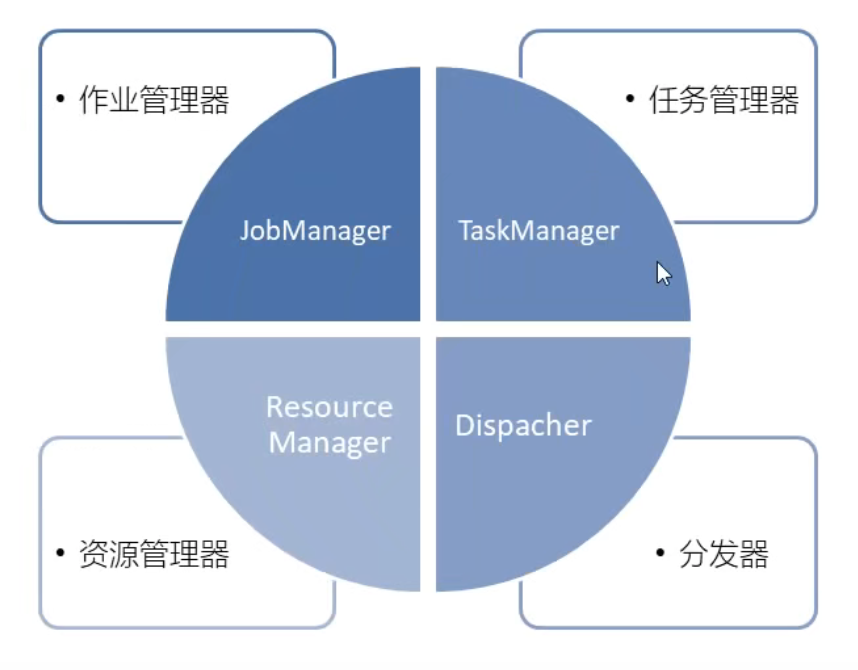
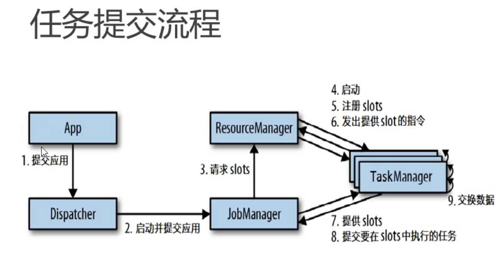
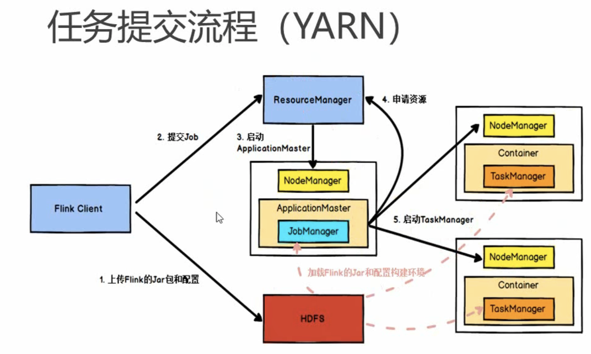

## Flink运行时组件

### 作业管理器 (JobManager)
- 控制一个应用程序执行的主进程，也就是说，每个应用程序都会被一个不同的
JobManager所控制执行。
- JobManager会先接收到要执行的应用程序，这个应用程序会包括：作业图 (JobGraph)、逻辑数据流图(logical dataflow graph)和打包了所有的类、
库和其它资源的AR包。
- JobManager会把JobGraph转换成一个物理层面的数据流图，这个图被叫做"执 行图”(ExecutionGraph),包含了所有可以并发执行的任务。
- JobManager会向资源管理器(ResourceManager)请求执行任务必要的资源， 也就是任务管理器(TaskManager)上的插槽(slot)。一旦它获取到了足够的 资源，就会将执行图分发到真正运行它们的TaskManager.上。而在运行过程中，
JobManagera会负责所有需要中央协调的操作，比如说检查点(checkpoints)的 协调。

### 任务管理器 (TaskManager)

- Flink中的工作进程。通常在Flink中会有多个TaskManageri运行，每一个
TaskManager都包含了一定数量的插槽(slots)。插槽的数量限制了
TaskManager能够执行的任务数量。
- 启动之后，TaskManager会向资源管理器注册它的插槽；收到资源管理
器的指令后，TaskManager就会将一个或者多个插槽提供给
JobManager调用。JobManager就可以向插槽分配任务(tasks)来执
行了。
- 在执行过程中，一个TaskManageri可以跟其它运行同一应用程序的
TaskManager交换数据。

### 资源管理器(ResourceManager)

- 主要负责管理任务管理器 (TaskManager）的插槽(slot),
TaskManger插槽是Flink中定义的处理资源单元。
- FIik为不同的环境和资源管理工具提供了不同资源管理器，比如YARN
Mesos、K8s,以及standalone部署。
- 当JobManager申请插槽资源时，ResourceManager会将有空闲插槽的
TaskManager分配给JobManager。如果ResourceManager没有足够的
插槽来满足JobManager的请求，它还可以向资源提供平台发起会话，
以提供启动TaskManageri进程的容器。

### 分发器(Dispatcher)

- 可以跨作业运行，它为应用提交提供了REST接口。
- 当一个应用被提交执行时，分发器就会启动并将应用移交给一个
JobManager。
- Dispatchert也会启动一个Web Ul,用来方便地展示和监控作业执
行的信息。
- Dispatcher在架构中可能并不是必需的，这取决于应用提交运行
的方式。

## 任务提交流程

## 任务调度原理