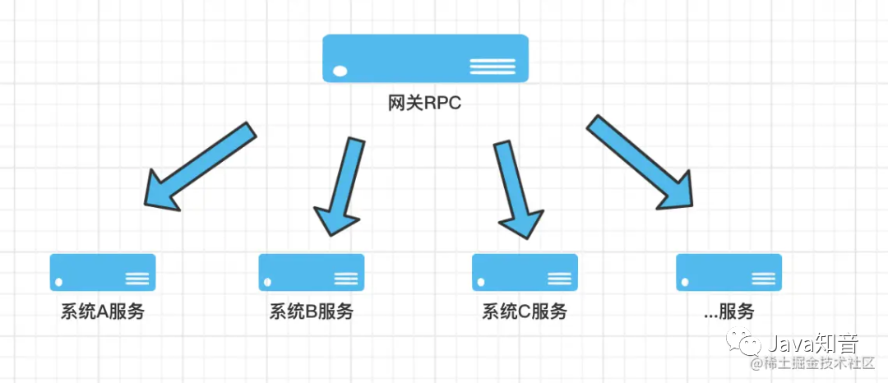
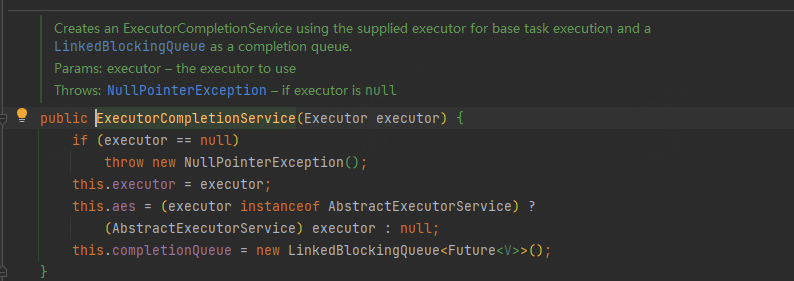
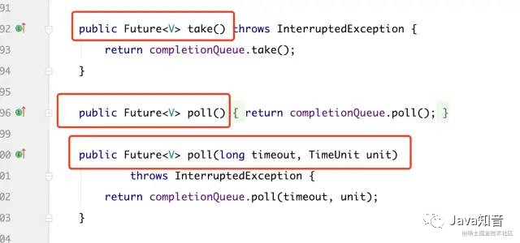

### 事故描述
线上代码出现oom

### 事故根本原因

事故代码模拟：

```java
public static void test() throws InterruptedException, ExecutionException {

    Executor executor = Executors.newFixedThreadPool(3);
    CompletionService<String> service = new ExecutorCompletionService<>(executor);
        service.submit(new Callable<String>() {
            @Override
            public String call() throws Exception {
                return "HelloWorld--" + Thread.currentThread().getName();
            }
        });
}
```

正确写法

```java
public static void test() throws InterruptedException, ExecutionException {
    Executor executor = Executors.newFixedThreadPool(3);
    CompletionService<String> service = new ExecutorCompletionService<>(executor);
    service.submit(new Callable<String>() {
        @Override
        public String call() throws Exception {
            return "HelloWorld--" + Thread.currentThread().getName();
        }
    });
    service.take().get();
}
```

一行代码引发的血案，而且不容易被发现。因为 OOM 是一个内存缓慢增长的过程，稍微粗心大意就会忽略。如果是这个代码块的调用量少的话，很可能几天甚至几个月后暴雷。

操作人回滚或者重启服务器确实是最快的方式。但是如果不是事后快速分析出 OOM 的代码，而且不巧回滚的版本也是带 OOM 代码的，就比较悲催了。如刚才所说，流量小了、回滚或者重启都可以释放内存；但是流量大的情况下，除非回滚到正常的版本，否则 GG。

### 探寻问题根源

为了更好的理解 `ExecutorCompletionService` 的 “套路”，我们用 `ExecutorService` 来作为对比，可以让我们更好地清楚什么场景下用 `ExecutorCompletionService。`

先看 `ExecutorService` 代码

```java
public static void test1() throws Exception{
    ExecutorService executorService = Executors.newCachedThreadPool();
    ArrayList<Future<String>> futureArrayList = new ArrayList<>();
    System.out.println("公司让你通知大家聚餐 你开车去接人");
    Future<String> future10 = executorService.submit(() -> {
        System.out.println("总裁：我在家上大号 我最近拉肚子比较慢 要蹲1个小时才能出来 你等会来接我吧");
        TimeUnit.SECONDS.sleep(10);
        System.out.println("总裁：1小时了 我上完大号了。你来接吧");
        return "总裁上完大号了";
    });
    futureArrayList.add(future10);
    Future<String> future3 = executorService.submit(() -> {
        System.out.println("研发：我在家上大号 我比较快 要蹲3分钟就可以出来 你等会来接我吧");
        TimeUnit.SECONDS.sleep(3);
        System.out.println("研发：3分钟 我上完大号了。你来接吧");
        return "研发上完大号了";
    });
    futureArrayList.add(future3);
    Future<String> future6 = executorService.submit(() -> {
        System.out.println("中层管理：我在家上大号  要蹲10分钟就可以出来 你等会来接我吧");
        TimeUnit.SECONDS.sleep(6);
        System.out.println("中层管理：10分钟 我上完大号了。你来接吧");
        return "中层管理上完大号了";
    });
    futureArrayList.add(future6);
    TimeUnit.SECONDS.sleep(1);
    System.out.println("都通知完了,等着接吧。");
    try {
        for (Future<String> future : futureArrayList) {
            String returnStr = future.get();
            System.out.println(returnStr + "，你去接他");
        }
        Thread.currentThread().join();
    } catch (Exception e) {
        e.printStackTrace();
    }
}
```
三个任务，每个任务执行时间分别是 10s、3s、6s 。通过 JDK 线程池的 submit 提交这三个 Callable 类型的任务。

- 第一步：主线程把三个任务提交到线程池里面去，把对应返回的 Future 放到 List 里面存起来，然后执行“都通知完了,等着接吧。”这行输出语句；

- 第二步：在循环里面执行 future.get() 操作，阻塞等待。

最后结果如下：

```
公司让你通知大家聚餐 你开车去接人
总裁：我在家上大号 我最近拉肚子比较慢 要蹲1个小时才能出来 你等会来接我吧
研发：我在家上大号 我比较快 要蹲3分钟就可以出来 你等会来接我吧
中层管理：我在家上大号  要蹲10分钟就可以出来 你等会来接我吧
都通知完了,等着接吧。
研发：3分钟 我上完大号了。你来接吧
中层管理：10分钟 我上完大号了。你来接吧
总裁：1小时了 我上完大号了。你来接吧
总裁上完大号了，你去接他
研发上完大号了，你去接他
中层管理上完大号了，你去接他

```

先通知到总裁，也是先接总裁 足足等了 1 个小时，接到总裁后再去接研发和中层管理，尽管他们早就完事儿了，也得等总裁上完厕所~~

耗时最久的-10s 异步任务最先进入 list 执行。所以在循环过程中获取这个 10 s的任务结果的时候，get 操作会一直阻塞，直到 10s 异步任务执行完毕。即使 3s、5s 的任务早就执行完了也得阻塞，等待 10s 任务执行完。

看到这里，尤其是做网关业务的同学可能会产生共鸣。一般来说，网关 RPC 会调用下游 N 多个接口，如下图：



如果都按照 ExecutorService 这种方式，并且恰巧前几个任务调用的接口耗时比较久，同时阻塞等待，那就比较悲催了。所以 ExecutorCompletionService 应景而出。它作为任务线程的合理管控者，“任务规划师”的称号名副其实。

相同场景 ExecutorCompletionService 代码：

```java
public static void test2() throws Exception {
    ExecutorService executorService = Executors.newCachedThreadPool();
    ExecutorCompletionService<String> completionService = new ExecutorCompletionService<>(executorService);
    System.out.println("公司让你通知大家聚餐 你开车去接人");
    completionService.submit(() -> {
        System.out.println("总裁：我在家上大号 我最近拉肚子比较慢 要蹲1个小时才能出来 你等会来接我吧");
        TimeUnit.SECONDS.sleep(10);
        System.out.println("总裁：1小时了 我上完大号了。你来接吧");
        return "总裁上完大号了";
    });
    completionService.submit(() -> {
        System.out.println("研发：我在家上大号 我比较快 要蹲3分钟就可以出来 你等会来接我吧");
        TimeUnit.SECONDS.sleep(3);
        System.out.println("研发：3分钟 我上完大号了。你来接吧");
        return "研发上完大号了";
    });
    completionService.submit(() -> {
        System.out.println("中层管理：我在家上大号  要蹲10分钟就可以出来 你等会来接我吧");
        TimeUnit.SECONDS.sleep(6);
        System.out.println("中层管理：10分钟 我上完大号了。你来接吧");
        return "中层管理上完大号了";
    });
    TimeUnit.SECONDS.sleep(1);
    System.out.println("都通知完了,等着接吧。");
    //提交了3个异步任务）
    for (int i = 0; i < 3; i++) {
        String returnStr = completionService.take().get();
        System.out.println(returnStr + "，你去接他");
    }
    Thread.currentThread().join();
}
```

结果如下：

```
公司让你通知大家聚餐 你开车去接人
总裁：我在家上大号 我最近拉肚子比较慢 要蹲1个小时才能出来 你等会来接我吧
研发：我在家上大号 我比较快 要蹲3分钟就可以出来 你等会来接我吧
中层管理：我在家上大号  要蹲10分钟就可以出来 你等会来接我吧
都通知完了,等着接吧。
研发：3分钟 我上完大号了。你来接吧
研发上完大号了，你去接他
中层管理：10分钟 我上完大号了。你来接吧
中层管理上完大号了，你去接他
总裁：1小时了 我上完大号了。你来接吧
总裁上完大号了，你去接他
```

这次就相对高效了一些。虽然先通知的总裁，但是根据大家上大号的速度，谁先拉完先去接谁，不用等待上大号最久的总裁了（现实生活里建议采用第一种，不等总裁的后果 emmm 哈哈哈）。

两段代码的差异非常小 获取结果的时候 `ExecutorCompletionService` 使用了：
```java
completionService.take().get();
```
为什么要用 take() 然后再 get() 呢？

我们看看源码：



ExecutorCompletionService 构造过程中会构建一个阻塞队列 `this.completionQueue = new LinkedBlockingQueue<Future<V>>();`

```java
    public Future<V> submit(Runnable task, V result) {
        if (task == null) throw new NullPointerException();
        RunnableFuture<V> f = newTaskFor(task, result);
        executor.execute(new QueueingFuture(f));
        return f;
    }
```
QueueingFuture。到底作用是啥，我们继续跟进去看：

QueueingFuture 继承自 FutureTask，而且红线部分标注的位置，重写了 done() 方法；

把 task 放到 completionQueue 队列里面。当任务执行完成后，task 就会被放到队列里面去了；

此时此刻，completionQueue 队列里面的 task 都是已经 done() 完成了的 task。而这个 task 就是我们拿到的一个个的 future 结果；

如果调用 completionQueue 的 task 方法，会阻塞等待任务。等到的一定是完成了的 future，我们调用  .get() 方法 就能立马获得结果。

看到这里，相信大家伙都应该多少明白点了：

我们在使用 ExecutorService submit 提交任务后需要关注每个任务返回的 future。然而 CompletionService 对这些 future 进行了追踪，并且重写了 done 方法，让你等的 completionQueue 队列里面一定是完成了的 task；

作为网关 RPC 层，我们不用因为某一个接口的响应慢拖累所有的请求，可以在处理最快响应的业务场景里使用 CompletionService。

### 事故核心
只有调用了 ExecutorCompletionService 下面的 3 个方法的任意一个时，阻塞队列中的 task 执行结果才会从队列中移除掉，释放堆内存。

由于该业务不需要使用任务的返回值，没有调用 take、poll 方法，从而导致没有释放堆内存。堆内存会随着调用量的增加一直增长。



所以，业务场景中不需要使用任务返回值的，别没事儿使用 CompletionService。假如使用了，记得一定要从阻塞队列中移除掉 task 执行结果，避免 OOM！

上线前
严格的代码 review 习惯，一定要交给 back 人去看，毕竟自己写的代码自己是看不出问题的，相信每个程序猿都有这个自信；

上线记录：备注好上一个可回滚的包版本（给自己留一个后路）；

上线前确认回滚后，业务是否可降级。如果不可降级，一定要严格拉长这次上线的监控周期。

上线后
持续关注内存增长情况（这部分极容易被忽略，大家对内存的重视度不如 CPU 使用率）；

持续关注 CPU 使用率增长情况

GC 情况、线程数是否增长、是否有频繁的 Full GC 等；

关注服务性能报警，TP99、999 、MAX 是否出现明显的增高。